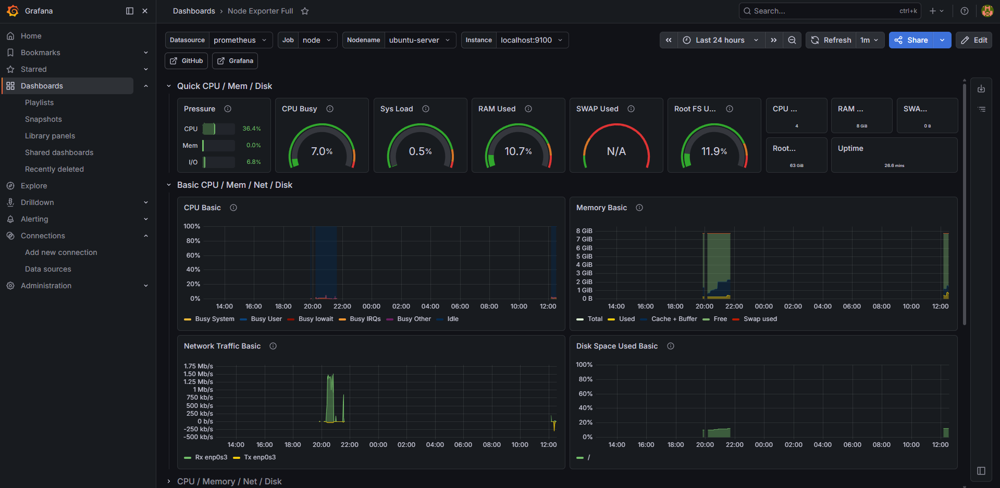
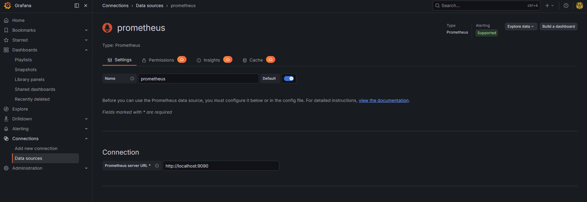
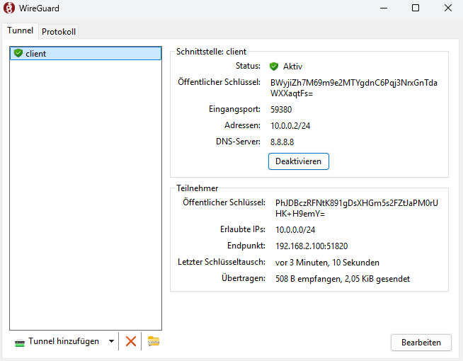
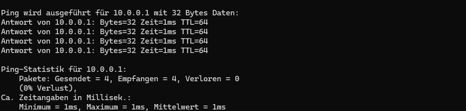
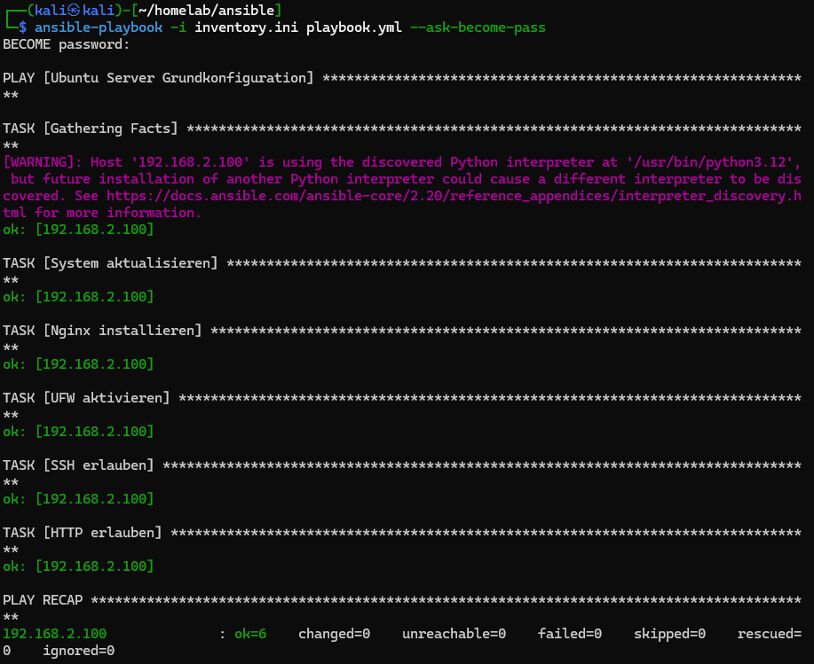
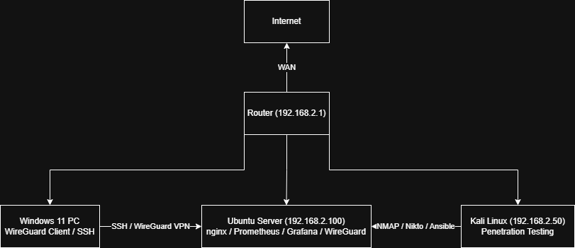
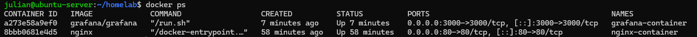
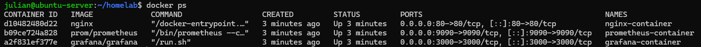

# Homelab

Dieses Projekt dokumentiert den Aufbau und Betrieb eines virtuellen Homelabs 
auf Basis von VirtualBox. Ziel ist es, praktische Erfahrungen in folgenden 
Bereichen zu sammeln und anzuwenden:

- Systemadministration
- Netzwerkmanagement
- IT-Sicherheit
- Automatisierung
- Containerisierung (Docker)

## Umgebung

- Host: Windows 11
- Virtualisierung: VirtualBox
- OS: Ubuntu Server 24.04 LTS

## Was bisher eingerichtet wurde

### 🌐 Netzwerk & System
- **SSH-Server** (openssh) - Sichere Fernverwaltung des Servers
- **Statische IP-Konfiguration** (Netplan) - Stabile Erreichbarkeit im Heimnetzwerk
- **Webserver** (nginx) - Hosting von Webinhalten

### 🔒 Sicherheit
- **Firewall** (ufw) - Default deny, nur SSH und HTTP erlaubt
- **Security Header** (nginx) - Schutz gegen gängige Web-Angriffe
- **Nmap Scan** - Netzwerk-Reconnaissance und Port-Analyse
- **Nikto Scan** - Webserver auf Schwachstellen geprüft und behoben
- **Kali Linux VM** - Dedizierte Penetration Testing Umgebung
- **Fail2ban** - Automatische IP-Sperrung bei Brute-Force Angriffen
- **Metasploit** - Brute-Force Simulation und Abwehr getestet

### 📊 Monitoring
- **Prometheus + Grafana** - Echtzeit-Überwachung von CPU, RAM, Netzwerk und Disk

### 🔐 VPN
- **WireGuard** - Moderner VPN-Server, Windows Client erfolgreich verbunden

### ⚙️ Automatisierung
- **Ansible Playbook** - Automatische Server-Grundkonfiguration (nginx, ufw, updates)

### 🐳 Containerisierung
- **Docker** - Nginx und Grafana als isolierte Container betrieben

## Voraussetzungen

- Windows 10/11
- VirtualBox (https://virtualbox.org)
- Ubuntu Server 24.04 LTS ISO
- Kali Linux VirtualBox Image

## Setup

1. VirtualBox installieren
2. Ubuntu Server VM erstellen (8GB RAM, 4 CPU, 50GB HDD)
3. Netzwerkbrücke in VirtualBox einstellen
4. SSH installieren: `sudo apt install openssh-server -y`
5. Statische IP setzen via Netplan (`192.168.2.100`)
6. Firewall aktivieren: `sudo ufw enable`
7. Nginx installieren: `sudo apt install nginx -y`
8. Prometheus + Grafana installieren
9. WireGuard VPN einrichten
10. Ansible Playbook ausführen: `ansible-playbook -i inventory.ini playbook.yml`

## Geplant

- Weitere Sicherheitstests mit Kali Linux (Metasploit, Nikto)
- Zweiter Ubuntu Server als Test-Ziel

## Screenshots

### Grafana Monitoring Dashboard

### Nginx Webserver

### Grafana Datenquelle

### WireGuard

### Ping_WireGuard

### Ansible Playbook

### Netzwerkdiagramm

### Docker Container

### Docker Compose

